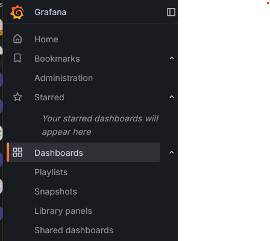
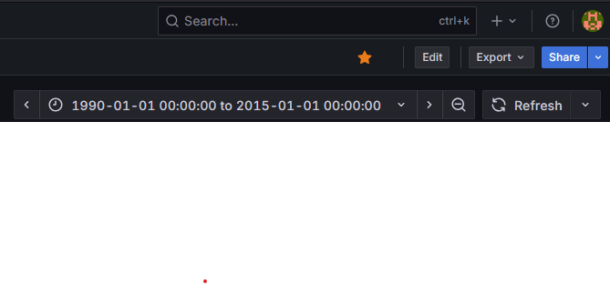
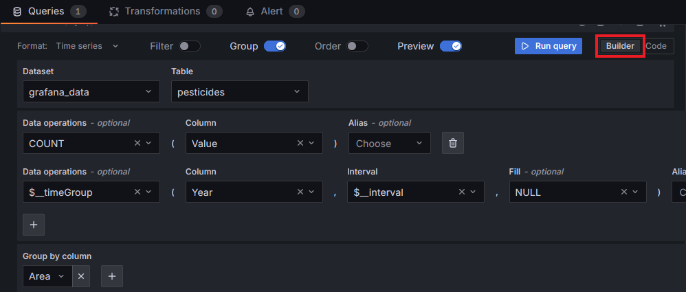
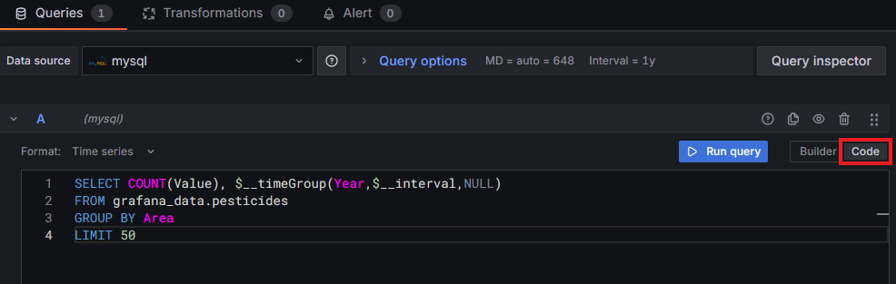

# Food Security Dashboard
This repository stores configuration items & documentation for the Food Security dashboard.


Details to set up the user profile can be found here:
[Setup Guide](./UserSetup.md)

### AWS EC2 Details
EC2 t3.medium with 80gb drive

### Grafana Details
Grafana setup details are as follows:
```
sudo apt-get install -y apt-transport-https software-properties-common wget
wget -q -O - https://apt.grafana.com/gpg.key | gpg --dearmor | sudo tee /etc/apt/keyrings/grafana.gpg > /dev/null
echo "deb [signed-by=/etc/apt/keyrings/grafana.gpg] https://apt.grafana.com stable main" | sudo tee -a /etc/apt/sources.list.d/grafana.list
sudo apt-get update
sudo apt-get install grafana
sudo systemctl status grafana-server
sudo systemctl daemon-reload
sudo systemctl daemon-reload
sudo systemctl start grafana-server
sudo systemctl status grafana-server
sudo systemctl edit grafana-server.service
```

Alex has the access details.

Need to change the running port, SSL, domain name, create users.


### MySQL Ver 8.0.42
MySQL has been installed on the Ubuntu server, ready to be connected to Grafana.

So far, only the root user has access. The database can be connected to by running the following commands:
```
$> sudo su
$> mysql -u root
```

I've created a database called grafana_data, and some tables to store mock data. 
The mock data is from a food security dataset on kaggle, I'll use it to populate the following tables:
pesticides
rainfall


```
mysql> CREATE DATABASE grafana_data;
mysql> USE grafana_data;
mysql> CREATE TABLE pesticides (
    Area VARCHAR(100),
    Element VARCHAR(100),
    Item VARCHAR(100),
    Year YEAR,
    Unit VARCHAR(100),
    Value INT
);
mysql> INSERT INTO pesticides VALUES("Albania", "Use", "Pesticides (Total)", "1998", "tonnes of active ingredients", "439.89");

CREATE USER 'user'@'localhost' IDENTIFIED BY '****';
GRANT INSERT, UPDATE, DELETE ON grafana_data.pesticides TO 'user'@'localhost';

CREATE USER 'grafana_read'@'localhost' IDENTIFIED BY '****';

```

### Making Grafana Widgets
I've created a test Dashboard on Grafana called Food Security Statistics.
If you open that, I've created two widgets, one is the avg of tons of pesticides across all countries per year, the other is a time series of each country/how much pesticides they use/year.


The backend SQL statement for the average of tons per year is:
```
SELECT
  AVG(Value)
FROM
  grafana_data.pesticides
GROUP BY
  Year
LIMIT
  50
```

The backend SQL statement for the time series is:
```
SELECT
  STR_TO_DATE(CONCAT(Year, '-01-01'), '%Y-%m-%d') AS time,
  Area AS country,
  Value AS pesticide_value
FROM
  grafana_data.pesticides
ORDER BY
  time ASC;
```


More instructions on how to access:
1. Open the dashboards tab on the Grafana dashboard

2. Edit the dashboard

3. Add the Visualization Widget

4. Edit the widget using the builder mode

5. Edit the widget using the SQL Builder mode



ToDO: We need to build some kind of database schema so we know what data is being referenced in Grafana 
